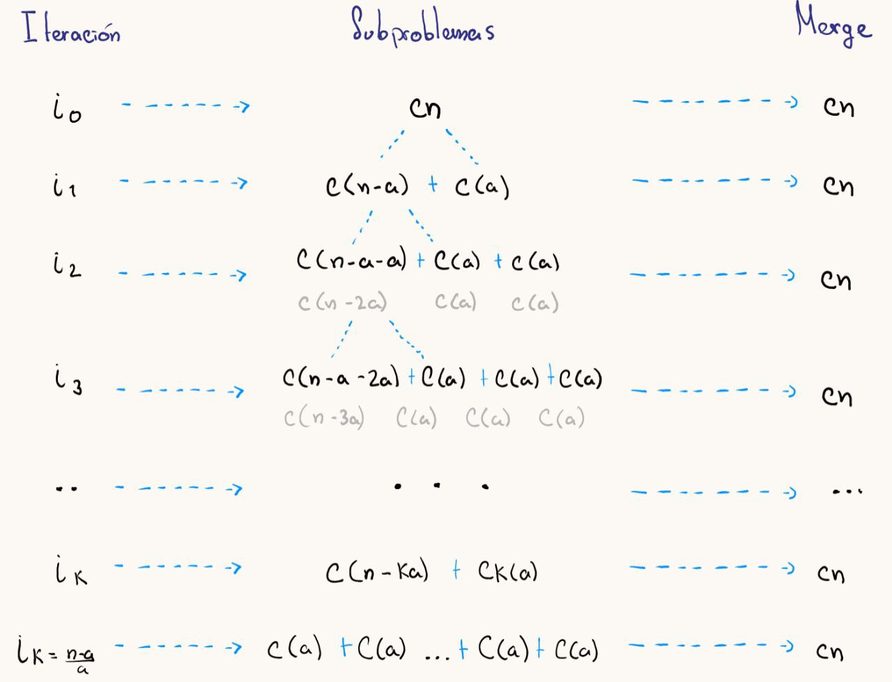
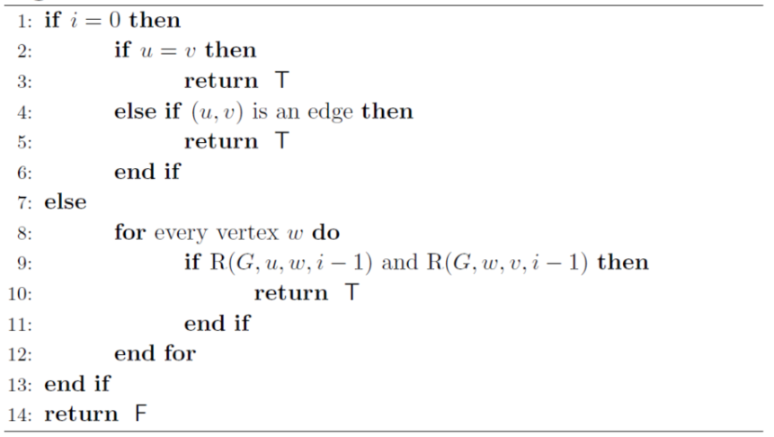

---
header-includes:
  - \usepackage{amsmath}
  - \usepackage{amssymb}
  - \usepackage{fontspec}
  - \setmainfont{FiraCode Nerd Font}
  - \usepackage{setspace}
  - \setstretch{1.5}
  - \usepackage{fvextra}
  - \DefineVerbatimEnvironment{Highlighting}{Verbatim}{breaklines,commandchars=\\\{\}}
geometry: top=0.67in, bottom=0.67in, left=0.85in, right=0.85in
---

# Divide and Conquer

## Integrantes

- Christian Echeverría  221441
- Gustavo Cruz          22779
- Josué Say             22801
- Mathew Cordero        22982
- Pedro Guzmán          22111

## Ejercicio 1

Use el método de sustitución para determinar la solución a la siguiente recurrencia:

$ T(n) = 4T\left(\frac{n}{2}\right) + n $. La solución de acuerdo con el *Master Method* es $\Theta(n^2)$, pero usar la hipótesis $cn^2$ falla. Realice el procedimiento bajo esa hipótesis para comprobar que falla y luego modifique la hipótesis para que funcione.

### Solución de Recurrencia por Método de Sustitución

#### Planteamiento Inicial

Tenemos la recurrencia $$T(n) = 4T\left(\frac{n}{2}\right) + n$$

Según el Teorema Maestro, esta recurrencia cae en el Caso 2, ya que $f(n) = n$ es polinomialmente menor que $n^2$ (donde $a=4$ y $b=2$). Por lo tanto, la solución debería ser $\Theta(n^2)$. Sin embargo, al intentar asumir $T(n) \leq cn^2$, la sustitución no funciona.

#### Primera Hipótesis

Asumamos que $T(k) \leq ck^2$ para todo $k < n$. Sustituyendo en la recurrencia:

$$T(n) = 4T\left(\frac{n}{2}\right) + n$$

Para simplificar la sustitución, podemos considerar $n$ como una potencia de 2 sin pérdida de generalidad:

$$T(n) = 4c\left(\frac{n^2}{4}\right) + n = cn^2 + n$$

Para que la hipótesis se mantenga, necesitaríamos:
$$cn^2 + n \leq cn^2$$

Esto implicaría que $n \leq 0$, lo cual es imposible ya que $n > 0$. Por lo tanto, la hipótesis inicial falla.

#### Cambio de hipótesis Hipótesis

Debido a que la hipótesis inicial falla, se realizaran cambios para la hipótesis de la forma $$T(n) \leq cn^2 - dn$$ para algunas constantes $c$ y $d$.

Sustituyendo en la recurrencia:
$$\begin{align*}
T(n) &= 4T\left(\frac{n}{2}\right) + n \\
&= 4\left(c\left(\frac{n^2}{4}\right) - d\left(\frac{n}{2}\right)\right) + n \\
&= 4c\left(\frac{n^2}{4}\right) - 4d\left(\frac{n}{2}\right) + n \\
&= cn^2 - 2dn + n
\end{align*}$$

Para que se cumpla $T(n) \leq cn^2 - dn$, necesitamos:
$$cn^2 - 2dn + n \leq cn^2 - dn$$

Simplificando:
1. Se resta $cn^2$ de ambos lados:
   $$-2dn + n \leq -dn$$
2. Agrupamos términos:
   $$(-2d + 1)n + (-dn) = (-3d + 1)n \leq 0$$

Para que esta desigualdad se cumpla para todo $n > 0$, se necesita:
$$-3d + 1 \leq 0 \implies d \geq \frac{1}{3}$$

#### Verificación para Casos Base
Por ultimo se verifican los pequeños valores de $n$:

Para $n = 2$:
$$T(2) = 4c - 4d + 2$$
Debe cumplir:
$$4c - 4d + 2 \leq 4c - 2d \implies -4d + 2 \leq -2d \implies -2d + 2 \leq 0 \implies d \geq 1$$

Para $n = 4$:
$$T(4) = 16c - 8d + 4$$
Debe cumplir:
$$16c - 8d + 4 \leq 16c - 4d \implies -8d + 4 \leq -4d \implies -4d + 4 \leq 0 \implies d \geq 1$$

#### Conclusión
La solución correcta requiere tomar $d \geq 1$. Con $d = 1$, tenemos:
$$T(n) \leq cn^2 - n$$

Esta forma satisface tanto la recurrencia como los casos base, confirmando que $T(n) = \Theta(n^2)$. La hipótesis inicial de $cn^2$ falló porque necesitábamos el término lineal negativo $-n$ para manejar los términos de orden inferior que surgían durante la sustitución.

## Ejercicio 2

Resuelva la recurrencia $ T(n) = 3T(\sqrt{n}) + \log_2 n $. Para hacerlo demuestre primero que se puede convertir en $ S(m) = 3S\left(\frac{m}{2}\right) + m $; y luego resuelva esta recurrencia con el método de sustitución. Con este resultado provea la respuesta para la recurrencia original.

**Hint**: note que, en $ S(m) $, $ m $ parece ocupar el lugar que $\log_2 n$ tiene en $ T(n) $.

## Ejercicio 3

Use un árbol de recursión para proveer una cota ajustada a la recurrencia $ T(n - a) + T(a) + cn $, donde $ a \ge 1 $, $ c > 0 $; ambas constantes. Puede suponer que $ n $ es múltiplo de $ a $.

### Solución

El problema nos indica que la función $ T(n) $ se divide en dos subproblemas: uno de tamaño $ T(n-a) $ y otro constante $ T(a) $. El tiempo total de ejecución en cada nivel de recursión es la suma de estos términos más un costo lineal adicional de $ cn $.

#### Iteración 1

- Cantidad de elementos: $ cn $
- Subproblema 1: $ c(n-a) $
- Subproblema 2: $ c(a) $
- **Total de tiempo de ejecución:** $ cn $, ya que:

  $$ c(n-a) + c(a) = cn - ca + ca = cn $$

#### Iteración 2

- Subproblema 1: $ c(n-a) $ se subdivide en:
  - Subproblema 1.1: $ c(n-a-a) = c(n-2a) $
  - Subproblema 1.2: $ c(a) $
- Subproblema 2: $ c(a) $
- **Total de tiempo de ejecución:** $ cn $, ya que:

  $$ c(n-2a) + c(a) + c(a) = cn - 2ca + ca + ca = cn $$

Siguiendo este patrón, podemos ver que en cada nivel la suma total del costo sigue siendo $ cn $.



#### Determinación de la cantidad de niveles

El proceso continúa hasta que el subproblema grande $ c(n-ka) $ sea igual a la constante $ c(a) $. Para encontrar el número de niveles $ k $, resolvemos:

$$ c(n-ka) = c(a) $$
$$ n-ka = a $$
$$ n-a = ka $$
$$ k = \frac{n-a}{a} = \frac{n}{a} - 1 $$

Por lo tanto, el árbol de recursión tiene $ k $ niveles.

#### Cálculo del tiempo total de ejecución

El tiempo total de ejecución es el número de niveles multiplicado por el costo de cada nivel:

$$ T(n) = k \cdot cn $$

Sustituyendo $ k = \frac{n}{a} - 1 $:

$$ T(n) = \left( \frac{n}{a} - 1 \right) cn $$

Distribuyendo:

$$ T(n) = \frac{cn^2}{a} - cn $$

El término dominante es $ \frac{cn^2}{a} $, ya que crece más rápido que $ cn $ cuando $ n $ tiende a infinito. Los factores constantes $ c $ y $ a $ no afectan la notación asintótica, por lo tanto, la cota ajustada es:

$$ T(n) = O(n^2) $$

Tu razonamiento tiene algunos errores, pero la idea general está bien orientada. Aquí te doy una versión corregida y mejorada de tu demostración:

### Demostración para $ T(n) = O(n^2) $

La recurrencia dada es:

$$
T(n) = \begin{cases}
O(1), & \text{si } n = a \\[6pt]
T(n - a) + T(a) + cn, & \text{si } n > a
\end{cases}
$$

#### **Paso inductivo:**
Queremos probar que también se cumple para $ n $.

Partimos de la recurrencia original:
$$
T(n) = T(n - a) + T(a) + cn
$$

Aplicando la hipótesis de inducción al término $ T(n - a) $:
$$
T(n - a) \leq c(n - a)^2
$$

Sabemos que $ T(a) $ es constante, ya que $ a $ es constante, digamos $ T(a) = O(1) \leq c a^2 $ para ajustar la notación.

Entonces:
$$
T(n) \leq c(n - a)^2 + c a^2 + cn
$$

Expandiendo el primer término:
$$
c(n^2 - 2an + a^2) + c a^2 + cn
$$

Agrupando términos semejantes:
$$
= c n^2 - 2 c a n + c a^2 + c a^2 + c n
$$

$$
= c n^2 - 2 c a n + c n + 2 c a^2
$$

Para valores grandes de $ n $, el término dominante es $ c n^2 $, ya que los términos lineales y constantes son despreciables en comparación con el crecimiento cuadrático.

Por lo tanto:
$$
T(n) \leq c n^2
$$

Dando como resultado:
$$
T(n) = O(n^2)
$$

#### **Caso Base:**
Para $ n = a $, la recurrencia indica:
$$
T(a) = O(1)
$$
Claramente:
$$
T(a) \leq c a^2
$$
para alguna constante $ c > 0 $, lo cual establece la base de la inducción.

## Ejercicio 4

Use el *Master Method* (si es posible) para dar cotas ajustadas a las siguientes recurrencias:  

### $ T(n) = 2T\left(\frac{n}{4}\right) + \sqrt{n} $  

### $ T(n) = 4T\left(\frac{n}{2}\right) + n^2 \log_2 n $

## Ejercicio 4

Use el *Master Method* (si es posible) para dar cotas ajustadas a las siguientes recurrencias:  

### $ T(n) = 2T\left(\frac{n}{4}\right) + \sqrt{n} $  

### $ T(n) = 4T\left(\frac{n}{2}\right) + n^2 \log_2 n $
$$
T(n) = n^2 \log n + 4T\left(\frac{n}{2}\right)
= n^2 \log n + 4 \left( \left(\frac{n}{2}\right)^2 \log\left(\frac{n}{2}\right) \right) + 16T\left(\frac{n}{4}\right)
= n^2 \log n + 4 \cdot \frac{n^2}{4} (\log n - 1) + 16 \left( \left(\frac{n}{4}\right)^2 \log\left(\frac{n}{4}\right) \right) + 64T\left(\frac{n}{8}\right)
= \ldots
$$
Puedes continuar despleando la recurrencia hasta $ T(1) $:
$$
= n^2 \log n + n^2 (\log n - 1) + n^2 (\log n - 2) + \ldots + n^2 (\log n - k)
$$
Donde $ k $ es el logaritmo base 2 de $ n $.

Finalmente, al simplificar y sumar todas las términos, obtienes:
$$
= \frac{1}{2} n^2 (\log n)^2 + n^2 T(1)
\in \Theta(n^2 (\log n)^2)
$$

## Ejercicio 5

Dé una recurrencia que cumpla con las condiciones del tercer caso del *Master Method* excepto la condición de regularidad.

## Ejercicio 6

Sea $ G = (V, E) $ un grafo dirigido. Deseamos determinar si existe un camino que conecte a dos nodos, $ u, v \in V $; esto se conoce como el *problema de conectividad-st* o *STCON*. El algoritmo de Savitch, presentado a continuación, determina si existe un camino con tamaño máximo $ 2^i $ entre dos nodos $ u, v $ del grafo $ G $:




Identifique las partes *Divide*, *Conquer* y *Combine* de este algoritmo, y determine (con notación asintótica) una cota superior para su tiempo de ejecución si se ejecuta para $i = \log_2 n$, donde $n$ es el número de vértices en el grafo. El tiempo de ejecución que encuentre, ¿será indicador de eficiencia (es decir, será que el algoritmo es “rápido”) o de ineficiencia (“lento”)?


## Solucion

Lo primero que vamos a hacer es analizar el algoritmo. 


### Analisis Algoritmo

```plaintext
Algorithm 3.4 Savitch
1: if i = 0 then
2:     if u = v then
3:         return T
4:     else if (u, v) is an edge then
5:         return T
6:     end if
7: else
8:     for every vertex w do  ---> Este es el divide
9:         if R(G, u, w, i - 1) and R(G, w, v, i - 1) then ----> Este es el conquer
10:            return T ----> Este es el combine.
11:        end if
12:    end for
13: end if
14: return F
```


Ahora determinaremos el tiempo de ejecucion de cada uno de ellos. $T(i)$ se define el tiempo de ejecucion para el tamaño i de una lista de vertices. 

**Divide** Divide se muestra de la siguiente manera. 
Se conoce que ```for very vertex w do``` y como se indica en el enunciado sera por un camino de tamaño maximo de $2^i$ pero al encontrar un camino de u a v y de v a u se dividira en 2 caminos. Uno de $2^{i-1}$ y otro de $2^{i-1}$.  Siendo la suma de ambos $2^i$


**Conquer**  En la linea ```if R(G, u, w, i - 1) and R(G, w, v, i - 1)```  se ve como n en tiempo de ejecucion 

**Combine** Se tarda en n en tiempo de ejecucion.


Dado que el valor máximo de \( i \) en la ejecución del algoritmo es \( \log_2 i \), expandimos la recurrencia:

$$
T(i) = i \cdot T(i - 1)
$$

$$
= i^2 \cdot T(i - 1)
$$

$$
= i^3 \cdot T(i - 1)
$$

Continuando hasta el caso base T(1), obtenemos:

$$
T(i) = n^i
$$

Aplicando i = $log_2 n$

$$
T(i) = n^{log_2 n}
$$

Por lo tanto, la cota superior asintótica del tiempo de ejecución es:

$$
O(n^{log_2 n})
$$


### Conclusiones
Para saber si fue mas rapido o mas lento debemos de ver algoritmos similares, pero antes analicemos nuestro algoritmo, primero no es olinomial sino exponencial , lo cual lo hace mas lento. 

Segundo existen algoritmos como el de  Floyd-Warshall  que son $O(n^3)$ que son mucho mas eficientes manejando el uso de encontrar caminos mas cortos en los pares de nodos. 

Asi que para el caso de $i = log_2 n$ es ineficiente. Pero si i no fuese ese caso de hecho su complejidad seria de $O(log_2 n)$

