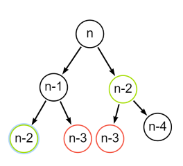
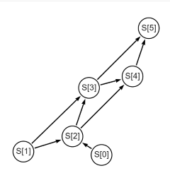

---
header-includes:
  - \usepackage{amsmath}
  - \usepackage{amssymb}
  - \usepackage{fontspec}
  - \setmainfont{FiraCode Nerd Font}
  - \usepackage{setspace}
  - \setstretch{1.5}
  - \usepackage{fvextra}
  - \DefineVerbatimEnvironment{Highlighting}{Verbatim}{breaklines,commandchars=\\\{\}}
geometry: top=0.67in, bottom=0.67in, left=0.85in, right=0.85in
---

# Grafo de Subproblemas

## Integrantes

- Christian Echeverría  221441
- Gustavo Cruz          22779
- Josué Say             22801
- Mathew Cordero        22982
- Pedro Guzmán          22111

## Ejercicio 6

Convierta el arbol de recursion de la pregunta anterior en un grafo de subproblemas, donde se elimine la ineficiencia planteada. Para que se plantee un grafo completo, considere el caso n = 5.


### Analisis

Podemos ver que tenemos un problema hay calculos que se realizan de manera redundante, por ejemplo :



Como puedes observar n-2 y n-3 se calcula dos veces en el grafo esto es ineficiente ya que puede hacer que calculemos una y otra vez el mismo calculo del numero n.

Para solucionarlo haremos lo siguiente

### Solucion

Usaremos el metodo Abajo hacia arriba que consiste en obtener el fibonaci de los numeros mas abajo de n y en base a ellos ir construyendo lo del siguiente repetidamente hasta que lleguemos a n.

Para ello se define el caso base:

$$S[0] = 0 ,  S[1] = 1$$

Donde definiremos un stack o pila:

$$S[i]$$

Donde se almacenara el fibonnaci del i-esimo numero n de la sucesion.

Por ello se define como el siguiente pseudocodigo para la solucion

```python
nodo(n){
1.  pila de enteros S[n+1]
2.  S[0] = 0
3.  S[1] = 1
  
4.  para cada i de 2 a n
5.    S[i] = S[i-1] + S[i-2]
6.    i+=1

7.  devolver S[n]
}
```

Si lo visualizamos en un grafo de suproblemas para un n = 5 tendremos:



Aqui lo que pasa es que estamos calculando en un stack de tamaño n+1 la secuencia de sucesiones que vimos en el grafo anterior.

Pongamos un ejemplo tenemos un n = 5, si seguimos el algoritmo tendriamos

```python
nodo(5){
1.  pila de enteros S[6]  //tenemos [0,0,0,0,0,0]
2.  S[0] = 0
3.  S[1] = 1
    //tenemos [0,1,0,0,0,0]

4.  para cada i de 2 a 5
5.    S[i] = S[i-1] + S[i-2]
      //i = 2  -> [0,1,1,0,0,0]
      //i= 3 ->[0,1,1,2,0,0]
      //i= 4 ->[0,1,1,2,3,0]
      //i=5 ->[0,1,1,2,3,5]
6.    i+=1

7.  devolver S[5]
}
```

Como te das cuenta suma dos posiciones anteriores y una posicion anterior de la pila para dar el siguiente numero de la sucesion numerica.
