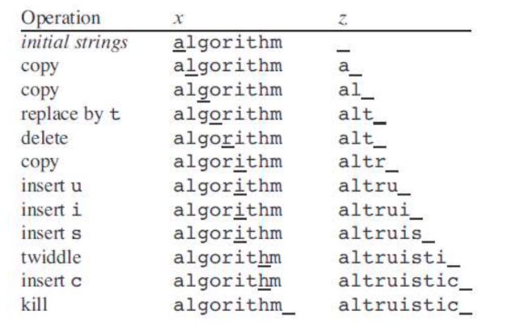

**3.** Tenemos dos **strings** $X$ e $Y$ cuyos tamaños son $m$ y $n$ respectivamente. Para transformar $X$ en $Y$ le aplicamos una secuencia de operaciones cuyos resultados se van almacenando en un **string** $Z$. La transformación se lleva con índices $i$ y $j$ sobre $X$ y $Z$ respectivamente, iniciando con $i = j = 1$. Cuando la transformación concluye se debe tener que $i = m + 1$, $j = n$ y $Z = Y$. Las operaciones permitidas para la transformación son las siguientes:

- **Copy:** copia un carácter de $X$ a $Z$ haciendo $Z[j] = X[i]$, y luego incrementa tanto $i$ como $j$.
- **Replace:** reemplaza un carácter de $X$ con algún otro carácter $c$ dado, haciendo $Z[j] = c$; y luego incrementa tanto $i$ como $j$.
- **Delete:** ignora un carácter de $X$ al incrementar $i$ sin incrementar $j$.
- **Insert:** inserta en $Z$ un carácter $c$ dado, haciendo $Z[j] = c$, y luego incrementa $j$ sin incrementar $i$.
- **Twiddle:** intercambia los siguientes dos caracteres de $X$ copiándolos en orden inverso. Para lograrlo hace $Z[j] = X[i + 1]$ y $Z[j + 1] = X[i]$, y luego incrementa tanto $i$ como $j$ dos unidades (i.e., $i = i + 2$, $j = j + 2$).
- **Kill:** ignora el resto de $X$ haciendo $i = m + 1$. Esta operación, si se usa, debe ser la última.

Cada operación tiene un costo constante propio, pero los costos de **Copy** y **Replace** son, cada uno, menores al costo de hacer **Delete** seguido de un **Insert**. Considere el siguiente ejemplo ilustrativo que convierte la palabra "algorithm" en "altruistic":





Para este ejercicio deberá desarrollar un algoritmo apoyado en el acercamiento *bottom-up* de programación dinámica que permita encontrar la secuencia de operaciones que convierte un *string* en otro incurriendo en el menor costo posible (este costo mínimo es llamado la *edit distance*). Para realizar el ejercicio siga los siguientes pasos:  

a. Identifique la subestructura óptima siguiendo el procedimiento enseñado en clase. *Hint:* para identificar los subproblemas, considere una secuencia de operaciones $(o_1, ..., o_k)\) dada como óptima. Habiéndose aplicado alguna de las operaciones, ¿qué podemos decir que tiene que haber sucedido antes de aplicarse dicha operación? ¿Cuál de los pasos del ejemplo hace la conversión más sencilla (caso base)?  

b. Esboce una tabla $T$ con $m$ filas y $n$ columnas. Esta tabla debe llenarse durante la ejecución de su solución *bottom-up*. ¿Cuál es el significado del contenido de la celda $T[i, j]$?  

c. Apoyándose en el inciso anterior, escriba la ecuación recurrente que computa el valor de la celda $T[i, j]$ tomando en cuenta las condiciones que restringen el uso de cada operación. Puede describir el costo de una operación como $\text{costo}(\text{nombre de operación})$.  


## Solucion
Se puede ver que 

### a) Subestructura Optima

los subproblemas son los siguientes. 

Identificamos las operaciones que son

- Copy (cuando los caracteres son iguales).
  
- Replace (reemplazar un carácter por otro).
Delete (eliminar un carácter de 
𝑋
X).
- Insert (agregar un carácter a 
𝑌
Y).
- Twiddle (intercambiar dos caracteres consecutivos).
- Kill (eliminar toda la cadena restante, solo si es la última operación).

Caso Base

- X está vacío, el costo es simplemente insertar todos los caracteres de 
𝑌.

- Si  𝑌 Y está vacío, el costo es eliminar todos los caracteres de 𝑋


- La copia de X y Y siendo iguales 


### b) Tabla T

$T[i][j]$ representa el costo mínimo de transformar los primeros i caracteres de X en los primeros 𝑗 caracteres de 𝑌

Para iniciar la tabla tenemos 

T[0][j] = j (convertir una cadena vacia a los primeros j caracteres)

T[i][0] = i convertir los primeros i de X en eliminaciones . 

### c) Ecuacion de Recurrencia
- $X[i] y Y[j]$ son  iguales$
$$T[i][j] = T[i-1][j-1] costo de la copia$$

- $X[i] y Y[j] no son iguales$

$T[i][j] sera$
- $T[i-1][j-1] + costo de Remplazar$
- $T[i-1][j] + costo de Eliminar$
- $T[i][j-1] + costo de Insertar$

En caso de Intercambio osea que los segundos 2 elementos si y solo si $X[i] = Y[j-1]$ o 
$X[i-1] = Y[j]$

Ahora el ejemplo del algoritmo en Pseudocodigo


```plaintext
FUNCION edit_distance(X, Y, cost_replace, cost_delete, cost_insert):
    m ← longitud(X)
    n ← longitud(Y)
    

    T ← matriz de tamaño (m+1) x (n+1) con valores 0


    PARA i DESDE 0 HASTA m:
        T[i][0] ← i * cost_delete


    PARA j DESDE 0 HASTA n:
        T[0][j] ← j * cost_insert


    PARA i DESDE 1 HASTA m:
        PARA j DESDE 1 HASTA n:
            SI X[i-1] == Y[j-1]:  
                T[i][j] ← T[i-1][j-1]
            SINO:
                T[i][j] ← mínimo(
                    T[i-1][j-1] + cost_replace, 
                    T[i-1][j] + cost_delete,
                    T[i][j-1] + cost_insert
                )

            SI i > 1 Y j > 1 Y X[i-1] == Y[j-2] Y X[i-2] == Y[j-1]:
                T[i][j] ← mínimo(T[i][j], T[i-2][j-2] + 1)

    RETORNAR T[m][n]


//Ejemplo de uso

X ← "algorithm"
Y ← "altruistic"
IMPRIMIR "Distancia de edición:", edit_distance(X, Y, 1, 1, 1)
```


